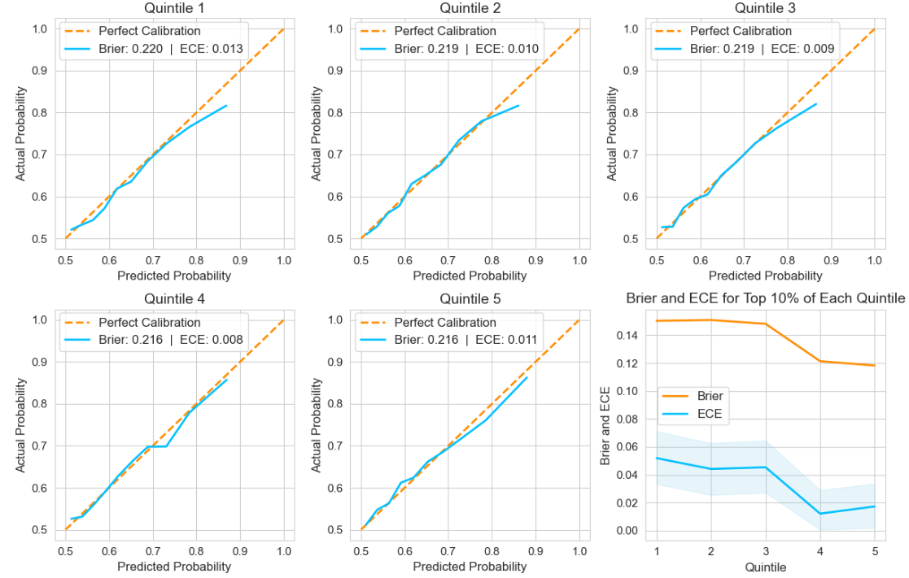

# Esports-Results-Project

This is a python-based project to predict the results of professional LoL (League of Legends) games.  It uses historical data from: www.oracleselixir.com/tools/downloads.
LoL is a game where 2 teams of 5 players select a "Champion" and fight each other using those Champions.
***

## Project Structure:
LoL_Data_Exploration.ipynb - Visualises the data, and uses statistical methods to explore relationships and variations in the data.

LoL_Elo_System.ipynb - Creates, optimises, and analyses an Elo system to predict the results of games based off of the players.

LoL_Predictions.ipynb - Predicts the results of LoL games using both the Elo system and the Champions selected in a meta model.

# Findings and Results
 <br>
In my EDA, I found that not only were there significant differences in metrics across the different positions, but that champions played across multiple positions maintain these positional differences.  I also found that the team on the Blue side wins games 53.5% of the time, and that the teams in a game explain more variation in the result than the Champions.

These findings informed my Elo rating where I optimized a custom variable to account for the Blue side team's inherent advantage, and my Gradient Boosting model, where I categorised Champions by position.

In order to predict the results of games, I created:
- An Elo system that learns the strength of players and teams from their previous results.
- A Gradient Boosting model to learn champion strengths and interactions.
- A Logistic Regression meta model to prevent underfitting champion data.

 <br>

The Elo system utilised composite ratings: rather than assigning a single rating per team, it calculated six ratings, one for each player and one for the organisation before adding them together.  To take into account the positional differences, I applied and optimised each component's weight in the composite rating as well as the rate of change for each component.

Because my Elo system was non-differentiable, I utilised NumPy arrays as both maps and vectors (for dot products) to significantly reduce the time to optimise using scipy.optimize.

The Elo system had a test accuracy of 65.36%.

 <br>

I analysed calibration of each quintile of game data, to evaluate how much the Elo system improved with training.  The system's calibration of the top 10% of games, by predicted probability, reduced from an ECE of 0.052, in the first quintile, to 0.017 in the fifth.  I found, using bootstrapping with a 0.95 confidence interval, that this decrease in ECE (overconfidence) was statistically significant with a lower bound of 0.0078.

I then engaged in two-stage modelling to prevent underfitting due to the suspected dominance of Elo Ratings over Champion data from my EDA.  I predicted the result of games by using the Champions selected in each position, using XGBoost to learn the impact of both champions, and champion interactions on the result.

However, due to the small population size of professional games, the gradient boosting model was not able to learn from many interactions without also learning noise, which necessitated strong regularisation.  It was able to learn certain common interactions such as Xayah and Rakan.

 <br>
We can see the positive impact on the result that the Xayah and Rakan interaction produces.

 <br>

I then used the Elo Differential, and probabilities from XGBoost, in a Logistic Regression meta model to predict the result of games.  The model had a Brier score of 0.215, and an ECE of 0.009 meaning that it was very well calibrated but had a low resolution (was poor at separating wins from losses) as we can see from the distribution of predicted probabilities.  It was also calibrated worse for predicted probabilities below 0.20.

It's Test Accuracy (65.68%) was also only marginally better than the Elo model, and so, the inclusion of Champion features did not notably improve the predictive capabilities of the model.  Future work could be done to find a solution to the small population size of professional games to improve the ability of the model to learn Champion interactions.

## Installation
```
git clone www.github.com/Samuel-Kelly-hub/Esports-Results-Project
cd Esports-Results-Project
pip install -r requirements.txt
```
## How to Run Notebooks
```
jupyter notebook
```
Run the notebooks in the following order:
1. `LoL_Data_Exploration.ipynb`
2. `LoL_Elo_System.ipynb`
3. `LoL_Predictions.ipynb`
